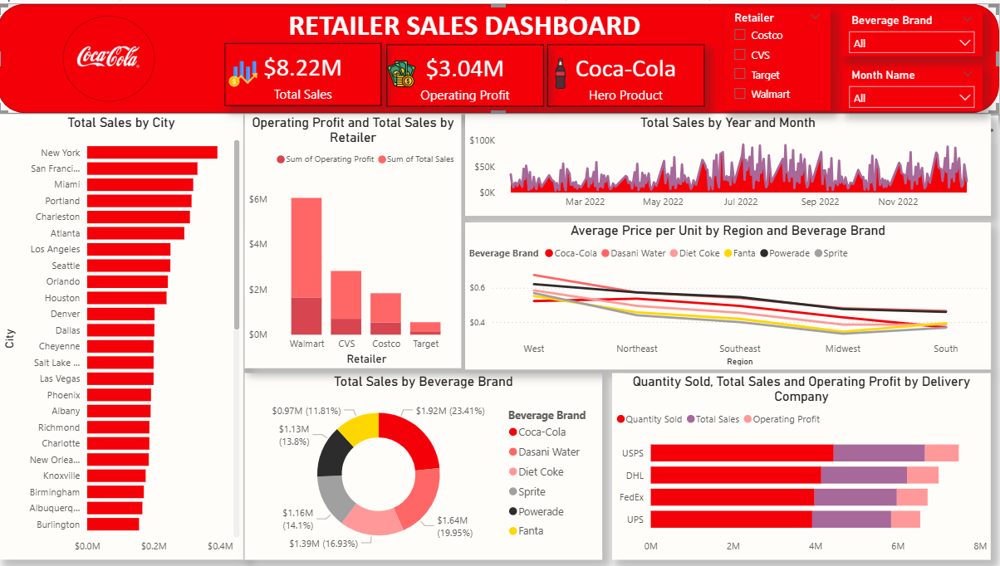

# 🥤 Retailer Sales Dashboard – Coca-Cola

## 📌 Overview
This Power BI dashboard provides insights into **retailer performance, beverage brand sales, and operating profits**.  
It allows retail managers and analysts to monitor **regional trends, delivery performance, and price variations**.

---

## 📷 Dashboard Preview

---

## 🛠 Features
- 💵 **Total Sales & Operating Profit KPIs**
- 🏙 **Sales by City**
- 🛒 **Retailer Performance Analysis**
- 📊 **Average Price per Unit by Region & Brand**
- 🚚 **Delivery Company Performance**
- 🍹 **Sales Distribution by Beverage Brand**

---

## 📂 Files in this Repository
- `CocaColaSales.pbix` → Power BI project file
- `Overview.png` → Dashboard screenshot
- `Sales.xlsx` → Sample dataset (if shareable)

---

## 🚀 How to Use
1. Download the `CocaColaSales.pbiix` file
2. Open in **Power BI Desktop**
3. Load/refresh your dataset
4. Use filters to explore retailer and brand-level insights

---

## 🎯 Key Insights
- **Hero Product:** Coca-Cola
- **Top Retailer by Profit:** Walmart
- **Strongest Region by Sales:** Northeast
